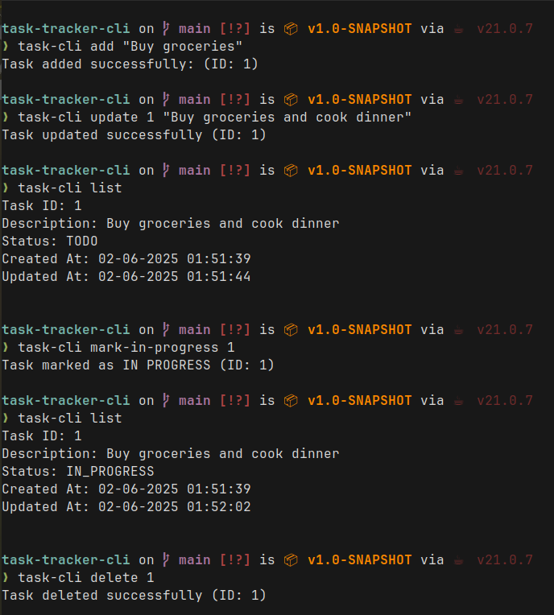

<a name="readme-top"></a>

<h3 align="center">Task Tracker CLI</h3>
  <p align="center">
  A Java CLI task tracker that uses the Google Gson library and a JSON file for persistent task management with support for adding, listing, updating, and deleting tasks.
  </p>
</div>

<!-- ABOUT THE PROJECT -->

<!-- ![Folder Page Screenshot][folder-screenshot] -->
<p align="center">
   <p align="center">
      <b><a href="https://github.com/astroflexx/task-tracker-cli" >Task Tracker CLI</a></b>
   </p>
   <p align="center">
      
   </p>
</p>

## About The Project

This was a project assignment from [roadmap.sh/java](https://roadmap.sh/java) course. The brief was to create a CLI task tracker used to track and manage tasks.

### Key Features
* **Task Management**: Add, list, and remove tasks using simple command-line commands.
* **Persistent Storage**: All task data is saved to and read from a local `db.json` file.
* **Status Tracking**: Each task can be marked with a status like `PENDING`, `IN_PROGRESS`, or `COMPLETED`.
* **Clean CLI Design**: Straightforward command syntax for ease of use (`add`, `list`, `delete`, etc.).
* **Enum-Based Status**: Uses Java `enum` to define and manage task statuses cleanly.
* **Immediate Persistence**: Changes are instantly written to the JSON file after each operation.

<!-- GETTING STARTED -->

## Getting Started

To get a local copy up and running follow these steps.

### Prerequisites

- **Java 21** or higher
- **Apache Maven**

### Installation

1. Clone the repo
   ```sh
   git clone https://github.com/astroflexx/task-tracker-cli.git
   cd task-tracker-cli
   ```
2. Build the project using Maven 
   ```sh
   mvn clean package
   ```
3. Set executable permission for the task-cli script 
   ```bash
   chmod +x task-cli
   ```
4. Add current directory to PATH
   ```bash
   export PATH="$PATH:$(pwd)"
   ```
5. Usage
    ```sh
    # Add a new task
    task-cli add "Buy groceries"
    # Output: Task added successfully (ID: 1)

    # Update a task
    task-cli update 1 "Buy groceries and cook dinner"

    # Mark a task as todo/in-progress/done
    task-cli mark-todo 1
    task-cli mark-in-progress 1
    task-cli mark-done 1

    # Listing all tasks
    task-cli list

    # Listing tasks by status
    task-cli list todo
    task-cli list in-progress 
    task-cli list done

    # Delete a task
    task-cli delete 1
    ```

<!-- [folder-screenshot]: usage.png  -->